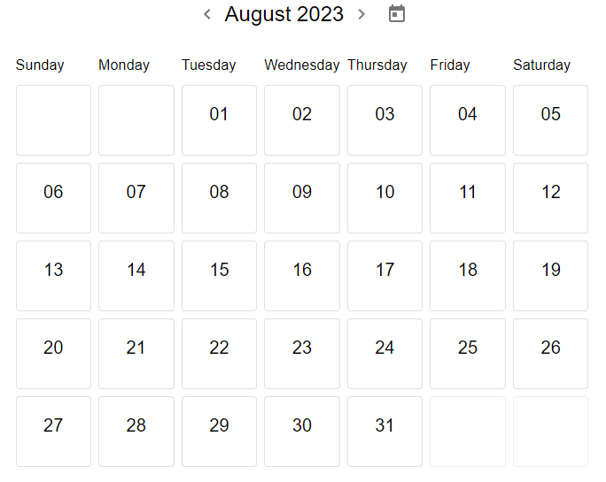

# 📆 Simple MUI Calendar

After searching and not finding any interesting calendar library, I decided to create one from scratch using MUI (Material-UI).

This project serves as an example of a calendar with just the basics. 
You can use it as a reference to create your own calendar and style it according to your preferences.

-----
### `npm start`

Runs the app in the development mode.\
Open [http://localhost:3000](http://localhost:3000) to view it in the browser.

### 
This project was bootstrapped with [Create React App](https://github.com/facebook/create-react-app).
